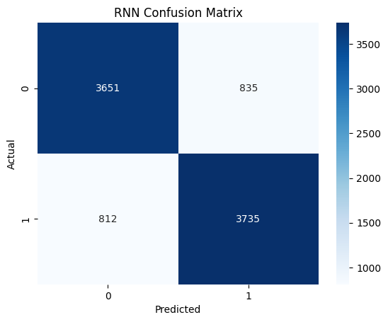
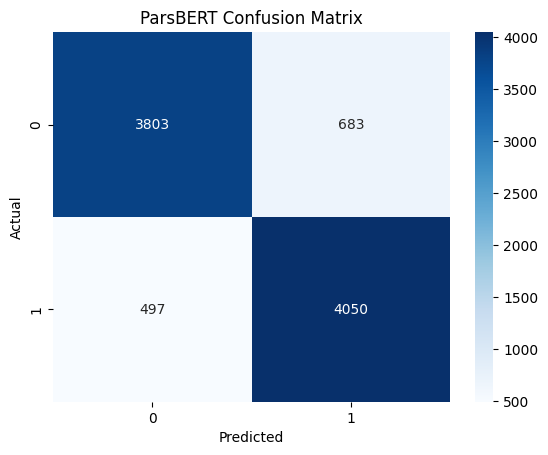

 
# Snapfood Comments Sentiment Analysis

[](https://github.com/Baaabaei/Snapfood-Comments-Sentiment-Analysis)
[](https://www.python.org/)
[](https://opensource.org/licenses/MIT)

A comprehensive comparative study of three distinct machine learning approaches for Persian sentiment analysis on real-world restaurant reviews from the Snapfood platform.

## 📋 Overview

This project benchmarks three different methodologies—ranging from classical machine learning to modern deep learning—to classify Persian comments about food and restaurant experiences. It demonstrates how transfer learning with a pre-trained Persian BERT model significantly outperforms other approaches.

**Key Research Questions:**
- How well do classical ML methods perform on Persian text?
- Can a simple LSTM capture semantic meaning effectively?
- Does a pre-trained transformer model (ParsBERT) provide superior results for this low-resource language task?

## 📊 Dataset

The dataset consists of user-submitted comments and ratings from the Snapfood delivery platform.

| Feature | Description |
| :--- | :--- |
| **Source** | Snapfood (Iranian food delivery platform) |
| **Availability** | Downloadable from [Kaggle](https://www.kaggle.com/) (Search: "Snapfood Comments") |
| **Total Samples** | ~61,000 |
| **Split** | 52,110 Training / ~9,000 Test |
| **Classes** | Binary (HAPPY = 0, SAD = 1) |
| **Balance** | Approximately 50% for each class |

> **Note:** The dataset is not included in this repository. You must download it separately from Kaggle and update the file paths in the notebook.

## 🧠 Models Implemented

The project implements and compares three models, from simple to complex:

### 1. TF-IDF + Logistic Regression
A classical Natural Language Processing (NLP) pipeline.

- **Preprocessing:** Persian stopword removal using the `hazm` library.
- **Vectorization:** TF-IDF (Term Frequency-Inverse Document Frequency).
- **Classifier:** Logistic Regression.
- **Result:** Provides a strong, fast, and interpretable baseline.

### 2. RNN (LSTM)
A simple Recurrent Neural Network using an LSTM (Long Short-Term Memory) layer to capture sequence information.

- **Architecture:** Embedding Layer → LSTM (32 units) → Dense (32, ReLU) → Output (Sigmoid).
- **Training:** 10 epochs with a batch size of 32.
- **Result:** Balanced performance, capturing more context than TF-IDF but limited by data size.

### 3. ParsBERT (Pre-trained Transformer)
A fine-tuned version of the state-of-the-art ParsBERT model, specifically pre-trained on a large Persian corpus.

- **Model:** `HooshvareLab/bert-base-parsbert-uncased` from Hugging Face.
- **Fine-tuning:** 3 epochs with a batch size of 16.
- **Result:** Achieves the best performance, demonstrating the power of transfer learning.

## 🚀 Getting Started

Follow these instructions to run the project locally.

### Prerequisites

Create a virtual environment and install the required libraries:

```bash
pip install pandas numpy scikit-learn
pip install tensorflow keras
pip install transformers torch
pip install hazm  # For Persian text processing
```

### Running the Jupyter Notebook

1.  **Clone the repository:**
    ```bash
    git clone https://github.com/Baaabaei/Snapfood-Comments-Sentiment-Analysis.git
    cd Snapfood-Comments-Sentiment-Analysis
    ```

2.  **Download the Dataset:**
    - Download the `snapfood_comments.csv` file from Kaggle.
    - Place it in the project root directory.

3.  **Update File Paths:**
    - Open the notebook `snapfood-comments-r-rnn-bert(1).ipynb`.
    - Locate the cell where the dataset is loaded and update the file path to point to your downloaded CSV file.

4.  **Run the Notebook:**
    - Execute the cells sequentially. For deep learning models, using a GPU runtime (e.g., on Kaggle or Google Colab) is recommended to speed up training.

## 📈 Performance Comparison

The table below summarizes the performance metrics for each model on the test set.

| Model | Accuracy | Precision | Recall | Training Time (Relative) |
| :--- | :--- | :--- | :--- | :--- |
| **TF-IDF + Logistic Regression** | 81.92% | 80.18% | 85.13% | Fast |
| **RNN (LSTM)** | 81.77% | 81.73% | 82.14% | Moderate |
| **ParsBERT** | **86.94%** ✨ | **85.57%** | **89.07%** | Slow |

## 📸 Visual Results

Here are the confusion matrices for each model, visualizing their performance on the test set.
 
### Confusion Matrix: TF-IDF + Logistic Regression

*Caption: The TF-IDF model confuses the two classes, but shows a good overall performance.*

### Confusion Matrix: LSTM Model

*Caption: The LSTM model shows similar performance to the logistic regression model.*

### Confusion Matrix: ParsBERT Model

*Caption: The fine-tuned ParsBERT model demonstrates the best performance, with significantly fewer misclassifications, especially in identifying negative (SAD) comments.*

## 🏗️ Code Structure

```text
Snapfood-Comments-Sentiment-Analysis/
├── snapfood-comments-r-rnn-bert(1).ipynb   # Main Jupyter Notebook with all experiments
├── README.md                               # This file
└── images/                                 # Directory for saving visual outputs (screenshots)
    ├── confusion_matrix_lr.png
    ├── confusion_matrix_lstm.png
    └── confusion_matrix_parsbert.png
```

## 💡 Conclusions

- **ParsBERT is the clear winner:** The pre-trained transformer model achieves the highest accuracy (**86.94%**), proving that transfer learning is highly effective for Persian NLP tasks.
- **Classical ML is still relevant:** The TF-IDF + Logistic Regression pipeline achieves a respectable **81.92%** accuracy, serving as a fast, resource-light baseline.
- **Simple RNNs are data-limited:** The LSTM model did not outperform the simpler logistic regression, suggesting that for this dataset size, a deeper or more sophisticated architecture might not yield significant gains without more data or better hyperparameter tuning.

## 🔮 Future Work

- **Multi-class Classification:** Incorporate the rating scores (e.g., 1-5 stars) to create a more granular sentiment analysis.
- **Aspect-Based Sentiment:** Identify sentiment towards specific aspects (e.g., food quality, delivery speed, service).
- **Real-time Deployment:** Create a simple API or Streamlit app to deploy the best-performing ParsBERT model.
- **Expand Dataset:** Incorporate more data from other Persian platforms to improve model robustness.

## 📚 References

- [ParsBERT: Transformer-based Model for Persian Language](https://huggingface.co/HooshvareLab/bert-base-parsbert-uncased)
- [Hazm: Persian NLP Library](https://github.com/sobhe/hazm)
- [Hugging Face Transformers](https://github.com/huggingface/transformers)

## 👤 Author

**Alireza Babazadeh Zarei**
- GitHub: [@Baaabaei](https://github.com/Baaabaei)
- LinkedIn: [inv-alizare](https://www.linkedin.com/in/inv-alizare/)

## 📄 License

This project is open-source and available under the [MIT License](https://opensource.org/licenses/MIT).

---

⭐ If you found this project interesting, please consider giving it a star!
``` 
